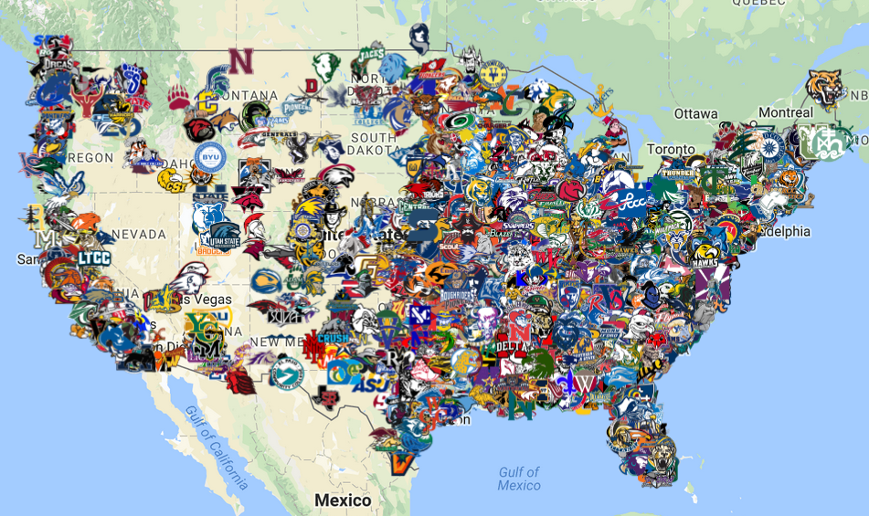

# US Universities and Colleges KMZ

[Click here to check out the map.](https://drive.google.com/open?id=15WgOlzIsOt8u-26dHnxlRJVoSOz9kzB-&usp=sharing)

Just a little project I've been working on in my spare time of placing the logo of every university and college in the United States on a Google Maps My Map in its respective location.

I began by scraping the logos from the user flairs on Reddit sports discussion forums. The icons from the college football subreddit are 60x40 pixels while those from the college basketball subreddit are 70x70 pixels. I made the remaining icons myself and sized them to 70x70 since that was easier to work with.

The flairs I scraped were divided by athletic conference which in retrospect probably was not the best way to approach, but that is how the folders are organized. Part I is all NCAA and NAIA schools. Part II is smaller conferences and a number of non-sports schools. I am sure I am missing many. Part III is community and junior colleges that are associated with an athletic conference. Part IV if I get around to it would be non-sports community and junior colleges.

These can be uploaded onto Google Maps using the My Maps feature. Within each folder in this repository is the folder of icons and a KML file. These should be zipped into a ZIP file which should then be renamed to be a KMZ file. The KMZ can then be uploaded onto a Google My Maps.

The KML file is an XML file and is pretty straight-forward. Google My Maps are limited to ten layers so I could not upload everything onto one map the way I have organized. In order to do that, I had to go into each KML file and remove all the dividing layers so all the schools are in large layer. For example in Part I, there are layers called FBS, FCS, D1 BB, D2, D2 BB, D3, D3 BB, NAIA, and NAIA BB which I removed and placed under one overhead layer titled Part I. Then they can be compressed into a KMZ and uploaded onto My Maps and will appear as one layer.

## Repository Breakdown

### Part I

These schools are well-documented and straight-forward.

  * [FBS](https://en.wikipedia.org/wiki/List_of_NCAA_Division_I_FBS_football_programs)
  * [FCS](https://en.wikipedia.org/wiki/List_of_NCAA_Division_I_FCS_football_programs)
  * [D1 BB](https://en.wikipedia.org/wiki/List_of_NCAA_Division_I_men%27s_basketball_programs)
  * [D2](https://en.wikipedia.org/wiki/List_of_NCAA_Division_II_football_programs)
  * [D2 BB](https://en.wikipedia.org/wiki/List_of_NCAA_Division_II_institutions)
  * [D3](https://en.wikipedia.org/wiki/List_of_NCAA_Division_III_football_programs)
  * [D3 BB](https://en.wikipedia.org/wiki/List_of_NCAA_Division_III_institutions)
  * [NAIA](https://en.wikipedia.org/wiki/List_of_NAIA_football_programs)
  * [NAIA BB](https://en.wikipedia.org/wiki/List_of_NAIA_institutions)

### Part II

This section was pretty difficult. There is a good amount of overlap between conferences and schools that have questionable legitimacy and accreditation. Unaffiliated schools are simply those that are not a part of a varsity intercollegiate athletic conference. Some notable schools in this section include BYU-Idaho, Georgia Gwinnett, Kettering, and Michigan-Flint.

  * [USCAA](https://en.wikipedia.org/wiki/List_of_USCAA_institutions)
  * [NCCAA](https://en.wikipedia.org/wiki/List_of_NCCAA_institutions)
  * [ACCA](https://en.wikipedia.org/wiki/Association_of_Christian_College_Athletics)
  * [ORCC](https://en.wikipedia.org/wiki/Ohio_Regional_Campus_Conference) and [OCAC](https://en.wikipedia.org/wiki/Ohio_Collegiate_Athletic_Conference)
  * Unaffiliated (Various sources)

### Part III

These are community and junior colleges that are affiliated with an athletic conference.

  * [Regions 1 - 5](https://en.wikipedia.org/wiki/National_Junior_College_Athletic_Association#Conferences_and_regions)
  * [Regions 6 - 10](https://en.wikipedia.org/wiki/National_Junior_College_Athletic_Association#Conferences_and_regions)
  * [Regions 11 - 15](https://en.wikipedia.org/wiki/National_Junior_College_Athletic_Association#Conferences_and_regions)
  * [Regions 16 - 20](https://en.wikipedia.org/wiki/National_Junior_College_Athletic_Association#Conferences_and_regions)
  * [Regions 21 - 24](https://en.wikipedia.org/wiki/National_Junior_College_Athletic_Association#Conferences_and_regions)
  * [WJCAA](https://en.wikipedia.org/wiki/Wisconsin_Collegiate_Conference)
  * [CCCAA](https://en.wikipedia.org/wiki/California_Community_College_Athletic_Association)
  * [NWAC](https://en.wikipedia.org/wiki/Northwest_Athletic_Conference)

### Part IV
